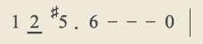

# Jianpu Editor

A simple WYSIWYG *jianpu* editor, currently just an experimental project.

You can get beautified *jianpu* score result by inputing notes in an intrusive way:

- `1` inputs a *Do* quarter note
- `2/` inputs a *Re* eighth note
- `5#.` inputs a *Sol-sharp* quarter note with a dot
- `6---` inputs a *La* whole note
- `0` inputs a quarter rest
- `|` inputs a bar line
- ...

By typing these character sequences, the result *jianpu* displays instantly:



There is a blinking cursor telling you where your next note will be inserted. You can navigate it to any place where new notes should be inserted, and you can delete a note simply by pressing <kbd>Delete</kbd> or <kbd>Backspace</kbd> just like editing text.

> The purpose of this editor is to give few restriction instead of strictly following the *jianpu* standard. You can freely write music components even if they do not make sense. In current version, there are restrictions that `.` and `-` can only appears after `0`-`7`, and accidentals like `#`, `b`, `n`, or octave shifts like `l`, `h` can only appears after `1`-`7`. However, I consider to remove these restrictions in the future to let you write departed accidentals and octave dots. After all, given that a `´` symbol can live without a letter below, why not the accidentals?

It is worth noting that these input sequences can be directly written to a file format called [`Jianpu Markdown`](./docs/jianpu-markdown/Jianpu%20Markdown%20Tutorial.md) and being displayed again by feeding the file to the editor. That is why the input format is designed to be both easy to type and easy to read.

[A sample Jianpu Markdown file](./src/example-musics/example.jianpumd) (if compiled, the output is identical to [the example JSON file](./src/example-musics/example.jianpu.json))

More features are being developed! See [Roadmap](#roadmap) for more information.

## Setup

Install the dependencies:

```bash
pnpm install
```

## Get started

Start the dev server:

```bash
pnpm dev
```

Build the app for production:

```bash
pnpm build
```

Preview the production build locally:

```bash
pnpm preview
```

## Roadmap

- [ ] WYSIWYG staff editor
  - [x] Display music title, key and time signature, and the author
    - [x] Display HTML content in music title and the author
  - [ ] Display *jianpu* staff
    - [x] Display pitch notes
      - [x] Display octave dots
      - [x] Display half duration lines
      - [x] Display accidentals
      - [ ] Hide accidental if there is a former identical note within the bar
    - [x] Display rest notes
    - [x] Display dots and dashes
    - [x] Display bar lines
    - [ ] Merge the half lines of consecutive 8/16/32...th notes
    - [ ] Horizontally stretch and align to both ends, preventing wrap inside a bar.
  - [x] Edit music title, key and time signature, and the author
  - [ ] Edit *jianpu* staff
    - [ ] Navigation
      - [x] Display cursor position
      - [x] Keyboard Left/Right arrow as the basic method to navigate the cursor
      - [ ] Keyboard Up/Down arrow to move the cursor vertically
      - [ ] Click on the staff to navigate the cursor
    - [x] Input and change
      - [x] Insert pitch notes
      - [x] Insert octave dots
      - [x] Insert half duration lines
      - [x] Insert accidentals
      - [x] Insert rest notes
      - [x] Insert dots and dashes
      - [x] Insert bar lines
      - [x] Delete notes
      - [x] Attach slurs
    - [x] Modification
      - [x] Whole-score pitch shifting
  - [ ] Intellisense
    - [ ] Warn if a bar has less or more beats than those restricted by the time signature
  - [x] Import/Export
    - [x] Import music score from a Jianpu JSON file
    - [x] Import music score from a Jianpu Markdown file
    - [x] Export music score as Jianpu JSON format
    - [x] Export music score as Jianpu Markdown format
- [x] Jianpu Markdown language
  - [x] Parser (synchronized with editor features)

## Editor Usage

### Using the menu

The menu is at the top of the screen, with access to many editor functions.

#### Visibility

If the left-most arrow button is pointing upwards, the menu is always visible. If the arrow button is pointing downwards, the menu is hided automatically and visible if you hover around the top edge of the screen. You can click the arrow button to switch between these two modes.

#### More button

The button next to the arrow button is the *More* button. Menu items that have long names or less likely to be used are put inside the submenu of the More button.

#### Other buttons

Other buttons are more likely to be used and therefore direct accessible.

### Autosave

The latest state of the music will be saved in the browser's local storage. It will be restored after you refresh the page or reopen the page after closing.

### Edit title

#### Create title

If there is no title, click the `+Title` button in the menu. A default title will be created.

#### Editing title

Click on the title to enter edit mode. Press <kbd>Escape</kbd> or click outside the input area to exit editing.

You can Write HTML code in the title. A list of supported tags is in the [Jianpu Markdown Tutorial](./docs/jianpu-markdown/Jianpu%20Markdown%20Tutorial.md#HTML-parser).

#### Remove title

By deleting all the content of the title you remove the title.

#### Reset title

If you want to reset the title to the default or there are some problems with the title, you can press `+Title` button and click the `Ok` button on the prompted dialog.

### Edit key signature

#### Create key signature

If there is no key signature, click the `+Key` button in the menu. The default key `1 = C` will be created.

#### Editing key signature

Click on the key signature to enter edit mode. Press <kbd>Enter</kbd>, <kbd>Escape</kbd>, or click outside the input area to exit editing.

The key signature should be in the following format (whitespaces are insignificant):

```
<note> [accidental] [octave]
```

The default C key can be specified by `C`, `Cn`, `C4`, or `Cn4` (but by specifying `n`, a natural accidental will appear). If the note `1` represent the Bb3 pitch, you can specify it by `Bb3`.

If you entered an invalid key signature, it may be removed. You need to press `+Key` button again to reset it.

#### Remove key signature

You can remove the key signature by deleting all content in edit mode.

#### Reset key signature

Click `+Key` button to reset the key signature.

### Edit time signature

#### Create time signature

If there is no time signature, click the `+Tempo` button in the menu. The default time signature `4/4` will be created.

#### Editing

Click on the time signature to enter edit mode. Press <kbd>Enter</kbd>, <kbd>Escape</kbd>, or click outside the input area to exit editing.

The time signature should be in the following format (whitespaces are insignificant):

```
<numerator> / <denominator>
```

e.g. `4/4`, `3/4`, `2/2`, `3/8`, `5/4`, `6/8`, `13/11`...

If you entered an invalid time signature, it may be removed. You need to press `+Tempo` button again to reset it.

#### Remove time signature

You can remove the time signature by deleting all content in edit mode.

#### Reset time signature

Click `+Tempo` button to reset the time signature.

### Edit composer

#### Create composer

If there is no composer, click the `+Composer` button in the menu. A default composer will be created.

#### Editing composer

Click on the composer to enter edit mode. Press <kbd>Escape</kbd> or click outside the input area to exit editing.

You can Write HTML code in the composer. A list of supported tags is in the [Jianpu Markdown Tutorial](./docs/jianpu-markdown/Jianpu%20Markdown%20Tutorial.md#HTML-parser).

#### Remove composer

By deleting all the content of the composer you remove the title.

#### Reset composer

If you want to reset the composer to the default or there are some problems with the composer, you can press `+Composer` button and click the `Ok` button on the prompted dialog.

### Edit staff

#### Start editing

Click on the staff to enter edit mode.

#### Navigate the cursor

Use keyboard <kbd>←</kbd>/<kbd>→</kbd> arrow keys to navigate the cursor around the staff.

#### Insert a note

##### Insert a pitch note

Type number <kbd>1</kbd>~<kbd>7</kbd> to insert a pitch note. The corresponding sing notes are:

| *jianpu* note | sing note |
| --- | --- |
| 1 | Do |
| 2 | Re |
| 3 | Mi |
| 4 | Fa |
| 5 | Sol |
| 6 | La |
| 7 | Si |

##### Change the octave of a pitch note

The default octave of a pitch note is the octave that the Middle C is in (the 4th group). Note that *jianpu* is a relative staff notation, so `1` is not always equal to `C4`, but you can see it as a shifted `C4`.

> e.g. When a note in standard notation is `G4` and the key of the song is in G, the note in *jianpu* is written as `1`.

If you want to shift the octave of a pitch note higher or lower, put the cursor next to the note, and press <kbd>h</kbd> to shift an octave **h**igher, or <hbd>l</kbd> to shift an octave **l**ower. These can be applied multiple times and they add dots to the top or bottom of the note.

> e.g. `2h` means `D5` and `6ll` means `A2`.

##### Change the duration of a pitch note

The default duration of a pitch note is a quarter.

To shorten a note, put the cursor next to it and press <kbd>/</kbd> to divide it by 2. It can be applied multiple times. So `/` makes it an eighth note, and `//` makes it a sixteenth note, and so on. Each `/` will add an underline (a *half (duration) line*) to the note.

In the current version, a note with half lines are treated as a whole when deleting.

To lengthern a note, put the cursor next to it and press <kbd>-</kbd> to stretch it by a quarter. In *jianpu*, `1-`, `1--`, `1---` are the ways to represent a half note, a dotted half note, and a whole note. And it does visually add a hyphen next to a note.

> You can add `-` after a pitch note, a rest note (introduced later), and another `-`. You can not add `-` after a dot `.` or another thing.
> In the current version, you can add `-` after a eighth or minor duration note, which generally is not used in *jianpu*.

##### Attach an accidental to a pitch note

You can add a sharp (♯), flat (♭), or natural (♮) accidental to a pitch note.

To add any of these, put the cursor next to the note, and press:

- <kbd>#</kbd> for ♯
- <kbd>b</kbd> for ♭
- <kbd>n</kbd> for ♮

In the current version, a note with an accidental are treated as a whole when deleting.

##### Insert a rest note

Type number <kbd>0</kbd> to insert a rest note.

You can use half lines and dash lines to change the duration of a rest note, but you can not use accidentals or octave dots on it.

##### Insert a bar line

Despite there is a time signature that can be configured, bar lines are manually inserted so that you can freely control them.

To insert a bar line, put the cursor at the position where you want to insert it, and press <kbd>|</kbd> (<kbd>Shift</kbd>+<kbd>\\</kbd>).

If you press <kbd>|</kbd> next to a bar line, it will change to a final bar line.

If you press <kbd>|</kbd> next to a `:` text note, it will change to a repeat bar line, and press <kbd>|</kbd> again will change it to a final repeat bar line.

##### Add slurs to the notes

Slurs can be added by typing `[` before the start note and `]` after the end note. When there is a pair of these symbols, a curve will be drawn from the above of the note after the `[` to the above of the note before the `]`. When the cursor is next to a `[` or right before a `]` symbol, it is placed next to the start or before the end of the curve to distinguish with the position before the `[` and next to the `]` symbol.

If there is an unpaired `[` symbol, a curve will be drawn from the note next to it to beyond the end of the staff without ending.

##### Delete a note or any thing

Put the cursor next to the thing you want to delete, and press <kbd>Backspace</kbd>.

### Import and export

#### Import

In the More submenu, you can click on the `Import from Jianpu Markdown...` menu item to import from a Jianpu Markdown file, or `Import from Jianpu JSON...` menu item to import from a Jianpu JSON file.

#### Export

In the More submenu, you can click on the `Export as Jianpu Markdown...` menu item to export the music as a Jianpu Markdown file, or `Export as Jianpu JSON...` menu item to export the music as a Jianpu JSON file.
